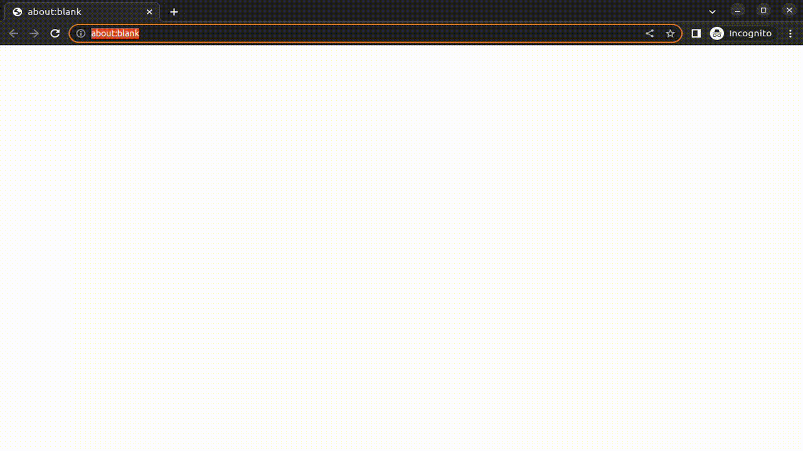

# Smoky

`smoky` - a simple smoke test tool.

## Idea

`smoky` is a CLI-based tool capable of orchestrating simple smoke tests against a running web application.

Using a configuration file, you can easily configure acceptance smoke tests. The currently supported types are:

- HealthCheck tests: These tests make it possible to check the health of a web application
- E2E tests: Leveraging [Playwright for .NET](https://playwright.dev/dotnet/) these tests allow simple E2E tests to be run using a headless browser (currently Chrome-based only)

> The basic intent of `smoky` is to perform some smoke tests on a web application during the integration deployment pipeline and get instant feedback on whether the deployment succeeded and the web application is up and running as expected.

## Demo



## Usage

```console
Usage: smoky [command] [options]

Options:
  -?|-h|--help  Show help information.

Commands:
  init          Initializes and scaffolds an empty smoky config file (eg. init -n <some-name>).
  ping          Executes a ping to a domain to test (eg. ping "https://my-domain.com").
  test          Executes the configured test assertions in the config tool (eg. test config.json -d "https://my-domain.com").

Run 'smoky [command] -?|-h|--help' for more information about a command.
```

## Configuration sample

```json
{
  "Domain": "https://localhost:5001",
  "Headless": false,
  "Slow": 500,
  "Timeout": 5000,
  "Channel": "chrome",
  "Tests": {
    "HealthTests": [
      {
        "Name": "System is healthy",
        "Expected": "Healthy",
        "PropertyPath": "status",
        "Route": "health"
      },
      {
        "Name": "All users seeded",
        "Expected": "Healthy",
        "PropertyPath": "info[0].status",
        "Route": "health"
      }
    ],
    "E2ETests": [
      {
        "Name": "Should login",
        "Route": "Login",
        "Arrange": [
          {
            "Step": "Should enter username",
            "LocatorType": "GetByLabel",
            "Text": "Username",
            "Action": "Fill",
            "Value": "admin"
          },
          {
            "Step": "Should enter password",
            "LocatorType": "GetByLabel",
            "Text": "Password",
            "Action": "Fill",
            "Value": "password"
          }
        ],
        "Act": {
          "Step": "Should click login",
          "LocatorType": "GetByRole",
          "AriaRole": "Button",
          "Text": "Login",
          "Action": "Click"
        },
        "Assert": [
          {
            "Step": "Should display Logout button",
            "LocatorType": "GetByRole",
            "AriaRole": "Button",
            "Text": "Logout",
            "Action": "IsVisible"
          }
        ]
      },
      {
        "Name": "Should display home",
        "Route": "",
        "Act": {
          "Step": "Should click admin navigation item",
          "LocatorType": "GetByRole",
          "AriaRole": "Link",
          "Text": "Admin",
          "Action": "Click"
        },
        "Assert": [
          {
            "Step": "Should display home page",
            "LocatorType": "GetByRole",
            "AriaRole": "Heading",
            "Text": "Workflows",
            "Action": "IsVisible"
          }
        ]
      },
      {
        "Name": "Should display holidays page",
        "Route": "",
        "Act": {
          "Step": "Should click holiday navigation item",
          "LocatorType": "GetByRole",
          "AriaRole": "Link",
          "Text": "Holiday",
          "Action": "Click"
        },
        "Assert": [
          {
            "Step": "Should display holidays page",
            "LocatorType": "GetByRole",
            "AriaRole": "Heading",
            "Text": "Holidays",
            "Action": "IsVisible"
          }
        ]
      },
      {
        "Name": "Should display issues page",
        "Route": "",
        "Act": {
          "Step": "Should click issue navigation item",
          "LocatorType": "GetByRole",
          "AriaRole": "Link",
          "Text": "Issue",
          "Action": "Click"
        },
        "Assert": [
          {
            "Step": "Should display issues page",
            "LocatorType": "GetByRole",
            "AriaRole": "Heading",
            "Text": "Issues",
            "Action": "IsVisible"
          }
        ]
      },
      {
        "Name": "Should display workflows page",
        "Route": "",
        "Act": {
          "Step": "Should click workflows navigation item",
          "LocatorType": "GetByRole",
          "AriaRole": "Link",
          "Text": "Workflows",
          "Action": "Click"
        },
        "Assert": [
          {
            "Step": "Should display instances page",
            "LocatorType": "GetByRole",
            "AriaRole": "Heading",
            "Text": "Instances",
            "Action": "IsVisible"
          }
        ]
      }
    ]
  }
}
```
